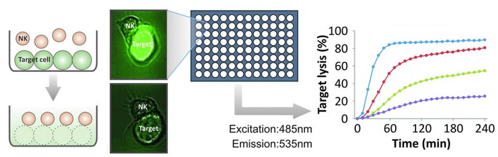

#### [Home](./index.html) 

# Research

T cells exert complex functions during a controlled immune response. Activation of naive (resting) T cells and the function of effector (activated) T cells require the formation of different immune synapses (IS) with antigen-presenting cells (APC) or target cells, respectively. For a proper T-cell response, redistribution of cytoskeletal structures (i.e. actin cytoskeleton, microtubules) and T-cell polarization of organelles (i.e. microtubule organization center, Golgi apparatus, endoplasmic reticulum, mitochondria, endosomes, lysosomes and other vesicles) during IS formation are required. For instance, the actin cytoskeleton is crucial for IS generation, the endoplasmic reticulum has to move to the plasma membrane to activate ORAI calcium channels during IS formation, mitochondria have to form an intimate contact with the plasma membrane at the IS to control calcium signals at the IS, and perforin-containing vesicles have to be reoriented to the IS to kill target cells. IS formation thus involves the collective intracellular transport of several interacting cellular compartments along dynamically changing cytoskeleton structures.

**Our aims are:**

1.  Determine the principles of transport, polarization and self-organization of vesicles in CD4+ and CD8+ T cells.
2.  Analyze the dynamics of organelle (mitochondria, endoplasmic reticulum) transport and polarization pattern and their influence on spatiotemporal Ca2+ dynamics at the immune synapse.
3.  Analyze the polarization dynamics and function of cytoskeletal structures during migration and activation in primary human T cells. In collaboration with the theoretical projects on cytoskeleton self-organization and intracellular transport we aim at understanding mechanisms, functions and the interdependence of cytoskeleton rearrangement and organelle transport and polarization.
4.  In collaboration with clinics, elucidate the molecular mechanisms to regulate killer cell function in cancer patients, more particularly in tumor microenvironment.

### Project 1: SFB 1027

* * *

# Team

## Group leader:

#### Dr. Bin Qu

## Postdocs:

*   Dr. Renping ZHAO

#### PhD students:

*  Wenjuan YANG
*  Xiangda ZHOU
* 

* * *

# Publication
 
#### [(Full list here)](https://pubmed.ncbi.nlm.nih.gov/?term=%28%28%28Qu%2C+Bin%5BAuthor%5D%29+AND+%28Homburg%5BAffiliation%5D%29%29+OR+%28%28Qu%2C+Bin%5BAuthor%5D%29+AND+%28Hoth%2C+Markus%5BAuthor%5D%29%29+OR+%28%28Qu%2C+Bin%5BAuthor%5D%29+AND+%28Pei%2C+Gang%5BAuthor%5D%29%29%29&sort=pubdate&size=50)
 
#### Selected Publications:

*   [Interorganelle Tethering to Endocytic Organelles Determines Directional Cytokine Transport in CD4+ T Cells.](https://pubmed.ncbi.nlm.nih.gov/33106338/)  
Zhou Y, Zhao R, Schwarz EC, Akbar R, Kaba M, Pattu V, Helms V, Rieger H, Nunes-Hasler P, Qu B.  
**J Immunol**. 2020 Oct 26:ji2000195. doi: 10.4049/jimmunol.2000195. Online ahead of print. PMID: [33106338](https://pubmed.ncbi.nlm.nih.gov/33106338/) 

*   [High glucose distinctively regulates Ca2+ influx in cytotoxic T lymphocytes upon target recognition and thapsigargin stimulation.](https://pubmed.ncbi.nlm.nih.gov/32697355/)  
Zou H, Yang W, Schwär G, Zhao R, Alansary D, Yin D, Schwarz EC, Niemeyer BA, Qu B.  
**Eur J Immunol**. 2020 Jul 22. doi: 10.1002/eji.202048577. Online ahead of print. PMID: [32697355](https://pubmed.ncbi.nlm.nih.gov/32697355/) 

*   [Human profilin 1 is a negative regulator of CTL mediated cell-killing and migration.](https://pubmed.ncbi.nlm.nih.gov/28688208/)  
Schoppmeyer R, Zhao R, Cheng H, Hamed M, Liu C, Zhou X, Schwarz EC, Zhou Y, Knörck A, Schwär G, Ji S, Liu L, Long J, Helms V, Hoth M, Yu X, Qu B.  
**Eur J Immunol**. 2017 Sep;47(9):1562-1572. doi: 10.1002/eji.201747124. Epub 2017 Jul 31. PMID: [28688208](https://pubmed.ncbi.nlm.nih.gov/28688208/) 

*   [Bystander cells enhance NK cytotoxic efficiency by reducing search time.](https://pubmed.ncbi.nlm.nih.gov/28287155/)  
Zhou X, Zhao R, Schwarz K, Mangeat M, Schwarz EC, Hamed M, Bogeski I, Helms V, Rieger H, Qu B.  
**Sci Rep**. 2017 Mar 13;7:44357. doi: 10.1038/srep44357. PMID: [28287155](https://pubmed.ncbi.nlm.nih.gov/28287155/) 

*   [A simple, economic, time-resolved killing assay.](https://pubmed.ncbi.nlm.nih.gov/24599783/)  
Kummerow C, Schwarz EC, Bufe B, Zufall F, Hoth M, Qu B.  
**Eur J Immunol**. 2014 Jun;44(6):1870-2. doi: 10.1002/eji.201444518. Epub 2014 Apr 13. PMID: [24599783](https://pubmed.ncbi.nlm.nih.gov/24599783/) 

* * *

 This work is licensed under a <a rel="license" href="http://creativecommons.org/licenses/by/4.0/">Creative Commons Attribution 4.0 International License</a>.
